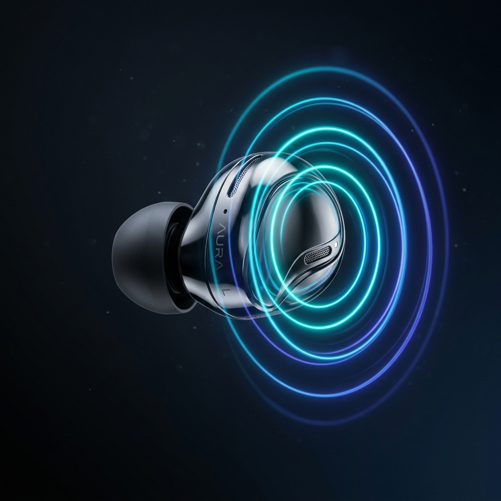
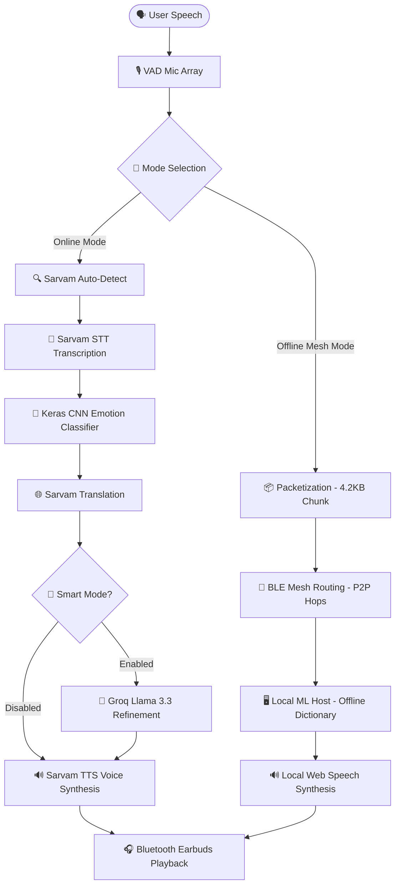

# 🎧 EarTranslate: 3D Holographic AI Translation & BLE Mesh Network

<p align="center">
  
</p>

> [!IMPORTANT]
> **EarTranslate** is a state-of-the-art dual-mode translation application designed to turn standard Bluetooth earbuds into real-time voice-activated translators. By merging best-in-class Indian speech AI (Sarvam AI), edge-processing (Keras CNN Voice Emotion Classifier), and localized peer-to-peer networking (decentralized Bluetooth Mesh routing), EarTranslate provides fluid translation in both connectivity-rich and zero-connectivity (offline) environments.

---

## ⚡ Main Systems Architecture

The application operates in two distinct pipelines depending on your connection status. Toggle **Offline Mesh Mode** to switch between these routing architectures:



---

## ✨ Features

### 1. 🌌 3D Holographic Mind Map & Explainer Deck
* **Custom 3D Matrix Projection Engine**: A lightweight, custom-coded HTML5 Canvas 3D rendering pipeline (no heavy WebGL/Three.js bundles) featuring flat-shaded solid polygons, a glowing circular projector platform, and dynamic space dust particles.
* **Projected DOM Card Overlays**: Absolutely-positioned HTML cards placed dynamically in the projection loop using `transform: translate(-50%, -50%) scale()` to bypass React virtual DOM diffing for smooth 60fps performance.
* **Upright Ergonomic Design**: Correct vertical alignment where the bulb body sits at the top, the eartip nozzle points downwards/inwards, and the stem hangs straight down.
* **Physical Details**: Dual gold-plated charging contact pads, custom mesh grill rendering, and status indicator LEDs that update dynamically on active routing.

### 2. 🧠 Edge-Processing Keras CNN Voice Classifier
* **Programmatic CNN Layer Architecture**: Programmatically extracts 216 Mel-frequency cepstral coefficients (MFCCs) using Librosa.
* **Sentiment & Tone Synthesis**: Feeds vectors into a convolutional neural network model to classify gender, mood (Concerned, Angry, Tired, Joyful, Neutral), and confidence metrics.

### 3. 🌐 Decentralized Bluetooth Mesh Routing
* **Self-Healing P2P Topology**: A fully simulated client-side node graph representing a local Bluetooth Mesh network.
* **Dynamic Relays**: Relays data packets through neighboring nodes (`Pixel 8 Pro`, `iPhone 15 Pro`).
* **Interactive Disconnections**: Click nodes on the interactive canvas to take them offline; the network dynamically reroutes or raises a partitioned alert (`⚠️ MESH PARTITIONED`).

### 4. 🎙️ VAD Silence Detector & Bluetooth Routing
* **RMS Level Monitoring**: Custom React microphone hook tracking sound amplitudes in real-time.
* **Silent Countdown**: Automatically cuts recording and triggers translation after `2200ms` of silence.
* **Targeted Output Playback**: Leverages browser `HTMLMediaElement.setSinkId()` to pipe voice synthesis audio directly to connected Bluetooth Earbuds rather than default system speakers.

---

## 🌐 Supported Languages & Valid Speakers

EarTranslate normalizes language inputs and maps them to valid, active speakers on the Sarvam AI Bulbul:v2 synthesis pipeline:

| Language | Code | Region Suffix | Assigned TTS Speaker | Voice Type |
|---|---|---|---|---|
| **English** | `en` | `en-IN` | `arya` | Masculine |
| **Hindi** | `hi` | `hi-IN` | `manisha` | Feminine |
| **Tamil** | `ta` | `ta-IN` | `anushka` | Feminine |
| **Telugu** | `te` | `te-IN` | `vidya` | Feminine |
| **Kannada** | `kn` | `kn-IN` | `vidya` | Feminine |
| **Malayalam** | `ml` | `ml-IN` | `vidya` | Feminine |
| **Bengali** | `bn` | `bn-IN` | `anushka` | Feminine |
| **Gujarati** | `gu` | `gu-IN` | `abhilash` | Masculine |
| **Marathi** | `mr` | `mr-IN` | `abhilash` | Masculine |
| **Punjabi** | `pa` | `pa-IN` | `abhilash` | Masculine |
| **Odia** | `od` | `od-IN` | `anushka` | Feminine |

---

## 🔑 Configure API Keys

The application requires a **Sarvam AI API Key** for core translation, speech-to-text (STT), and text-to-speech (TTS), and a **Groq API Key** for Llama 3.3 Smart Mode refinements.

1. Get a Sarvam API Key from [dashboard.sarvam.ai](https://dashboard.sarvam.ai).
2. Get a Groq API Key from [console.groq.com](https://console.groq.com).
3. Create a `.env` file in the `server` directory:

```env
PORT=3001
SARVAM_API_KEY=your_sarvam_api_key_here
GROQ_API_KEY=your_groq_api_key_here
```

---

## 🚀 Quick Start

### 1. Install Dependencies
```bash
# Install Server Dependencies
cd server
npm install

# Install Client Dependencies
cd ../client
npm install
```

### 2. Run the Servers

**Start Server (Terminal 1):**
```bash
cd server
npm run dev
```

**Start Client (Terminal 2):**
```bash
cd client
npm run dev
```

Open your browser and navigate to **[http://localhost:5173](http://localhost:5173)** to launch the EarTranslate Cockpit dashboard.

> [!WARNING]
> Chrome is highly recommended. Other browsers may lack full support for the `MediaRecorder`, `AudioContext`, and output device routing (`setSinkId()`).

---

## 🎧 Enforcing Bluetooth Earbud Audio Routing

To ensure real-time translation audio plays directly through your Bluetooth earbuds rather than the device's built-in speakers:

### Windows Configuration
1. Right-click the **Speaker** icon in the taskbar and select **Sound Settings** (or **Sounds** on older systems).
2. Go to the **Recording** tab → select your Bluetooth earbuds → click **Set Default**.
3. Go to the **Playback** tab → select your Bluetooth earbuds → click **Set Default**.
4. In Chrome, when requested for microphone access, approve it. 
5. Select your Bluetooth earbuds in the **Device Selector** panel in the EarTranslate web UI.

### macOS Configuration
1. Open **System Settings** → **Sound**.
2. Click **Input** → select your connected Bluetooth earbuds.
3. Click **Output** → select your connected Bluetooth earbuds.
4. Select your Bluetooth earbuds in the **Device Selector** panel in the EarTranslate web UI.

---

## 🏗️ Folder Structure

```
eartranslate/
├── client/                 # Frontend React application (Vite)
│   ├── src/
│   │   ├── components/     # Hologram, Mesh visualizer, Panels, Selectors
│   │   ├── hooks/          # Device enumeration, VAD Mic, Translation pipeline
│   │   ├── services/       # Express server API connector
│   │   ├── store/          # Zustand App state
│   │   └── constants/      # Languages constant mappings
│   └── public/             # Static graphics assets (PNGs, SVGs)
│
└── server/                 # Express backend server (TypeScript)
    ├── src/
    │   ├── routes/         # Transcribe, Speak, Translate, Refine API endpoints
    │   ├── services/       # Sarvam & Groq wrapper methods
    │   └── index.ts        # Express entry point
```

---

## 📜 License

MIT License. Designed for the Indian language AI community.
